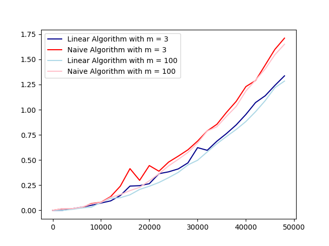

[](https://classroom.github.com/online_ide?assignment_repo_id=8379450&assignment_repo_type=AssignmentRepo)
# Basic exact pattern matching

This project is about exact pattern matching. You should implement the naive quadratic time algorithm and a linear time algorithm of your cheice, e.g. the border-array or the KMP-algorithm. The naive algorithm has the worst-case running time O(nm) and the other algorithms we have seen have worst-case running time O(n+m).

The algorithms should be implemented in two programs, `naive` and `lin`. Both programs should take two arguments (no more and no less): the first should be a Simple-FASTA file and the second a Simple-FASTQ file. The programs should output all matches in the Simple-SAM format to stdout (i.e., they should write to the terminal). Since we are only doing exact matching, the CIGAR strings in the output should consist of M’s only, since all the characters in the read will match the reference at the reported position.

For example, with this Simple-FASTA file

```
> chr1
mississippi
> chr2
mississippimississippi
```

and this Simple-FASTQ file

```
@read1
iss
@read2
mis
@read3
ssi
@read4
ssippi
```

your output should be

```
read1	chr1	2	3M	iss
read1	chr1	5	3M	iss
read1	chr2	2	3M	iss
read1	chr2	5	3M	iss
read1	chr2	13	3M	iss
read1	chr2	16	3M	iss
read2	chr1	1	3M	mis
read2	chr2	1	3M	mis
read2	chr2	12	3M	mis
read3	chr1	3	3M	ssi
read3	chr1	6	3M	ssi
read3	chr2	3	3M	ssi
read3	chr2	6	3M	ssi
read3	chr2	14	3M	ssi
read3	chr2	17	3M	ssi
read4	chr1	6	6M	ssippi
read4	chr2	6	6M	ssippi
read4	chr2	17	6M	ssippi
```

assuming you iterate over reads in an outer loop and FASTA records in an inner loop. If you order your loops differently, of course, the output will be different.

The project should be in groups of 2–3 students. It will not be graded.

## Part 1: parsers 

Write parsers for Simple-FASTA and Simple-FASTQ if you have not done so already.

## Part 2: simulating data for evaluation

For testing the running time as functions of n and m, you should also write code for generating Simple-FASTA and Simple-FASTQ files (with appropriate properties for your tests).

## Part 2: mappers

Now write the tools for exact pattern matching. You can use the naive algorithm to test your linear time algorithm; the result of the two programs that you write should be identical after you sort the output.

```sh
> ./naive fasta.fa fastq.fq | sort > naive.sam
> ./lin fasta.fa fastq.fq | sort > lin.sam
> diff naive.sam lin.sam
```

You might not have to sort the output, if you run through reads

## Evaluation

Implement the two algorithms in two tools, `naive` and `lin`, that must be present at the root of the repository once they are built. The test setup checks that they give the correct output on selected data, but you should still carefully test them.

Once you have implemented the tools, fill out the report below. 

## Report

### Insights you may have had while implementing and comparing the algorithms. 

Implementing the linear algorithm using border arrays seemed to work when running using the given simple_fasta and simple_fastq examples. However, it was realized quite late that it only worked correctly with patterns of length 3 (the first few outputs). There were some mistakes with the returned indexing of the matches.

The index to be returned should reflect the start of the match in the sequence x. However, the border array reflects the pattern p joined with x using a sentinel. Getting the indexing right by adjusting for the initial p, the sentinel and then adjusting to reflect the index at the start rather than end of the match made the solution a bit of a mess. Messy code (result.append(i-len(p)+1)) with multiple variables added and subtraced increases the likelihood of mistakes. The solution should therefore ideally be modified to clean this up. 

Furthermore, indexing from 1 causes some confusion when the python indexing starts at 0. Adding these +1 in many cases makes it easy to trip up on where they should and should not be added. It forces the programmer to be very wary of which index and value means what.

### Problems encountered if any. 

*Describe this here.*

### Experiments that verifies the correctness of your implementations.

We encountered some issues when trying to implement testing on the linear and naive algorithms. Even though they could be run with ease in the scripts in which they were defined with one case at a time, combining new random sequences with the algorithms required some modifications on the previous scripts, and addition of new functions.

For example, we decided that the randomly generated test sequences should be given as a list of strings rather than as text files, which we had previously tested on. However, the option to run text files by parsing through the terminal should also be available. A function for running the necessary functions outside of their original scripts was therefore created, while the main function in the script was kept to work with argparse.

To verify the correctness using as realistic data as possible we downloaded the genome of drosophila melanogaster from NCBI (https://www.ncbi.nlm.nih.gov/). However, we realized that processing all of it was an unnecessarily time consuming task. Therefore a section of 1000 lines of sequence was chosen and any fasta headers removed to give a clean sequence template to copy sections from for testing. For more extensive testing with longer sequences a larger selection of lines would be required. In hindsight, even though this gives a realistic time frame of alignment against a genome, creating functions for preprocessing took a bit too much time from the rest of the project.


### Experiments validating the running time.

For this section, you should address the following:

* An experiment that verifies that your implementation of `naive` uses no more time than O(nm) to find all occurrences of a given pattern in a text. Remember to explain your choice of test data. What are “best” and “worst” case inputs? 

A random sequence generator was created. This combines the four bases in random order according to a given seed. The option of a uniform base sequence is also given. Uniform sequences with the same base for p and x is the worst case for the naive algorithm since it runs through p for every index in x, due to p matching everywhere on x (O(nm). The best case input for the naive algorithm would be a mismatch at the first letter of p for every letter in x. This could be implemented by having uniform sequences for p and x but with different bases (O(n)).

#Include graph for naive:
 random 
 x = A^n, p = B^m 
 x = A^n, p = A^m


* An experiment that verifies that your implementations of `lin` use no more time than O(n+m) to find all occurrences of a given pattern in a text. Remember to explain your choice of test data. What are “best” and “worst” case inputs?

The linear should have linear runtime. By increasing m or n the slope increases.
#Include graph for naive:
 random 
 x = A^n, p = B^m 
 x = A^n, p = A^m

To compare the naive to the linear border algorithm, the same input data should preferably be used. We therefore used the genome sequence generator and varying the length n (range between length 0 and 50.000) of x with constant length m [3, 100] of p.

Varying the length n of x with constant length m of p :


